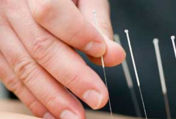

# The Five Pillars
The Five Pillars is a philosophy that inspires the exceptional; design, menu, programming, service and quality of the Trilogy brand.  These essential elements  of health and beauty soothe your soul and energise your spirit.

|    |    |
|  :-----          |  :-----          |
|   |  Spa & Beauty - Massage therapies and bodywork, body scrubs and wraps, facials and skincare services, beauty and style and energise your spirit. |
|   | Nutrition for Active Living - Consultations, supplemental vitamin prescriptions, healthy food and beverage menus, nutritional dignostics, weight management. |
|   |  Fitness - Gym, personal training, fitness diagnostics, Pilates, group classes (spinning, surf set, TRX, crossfit, hand boards, hula hoop, aerial yoga, soul cycle, stretching, yoga, meditation, and outdoor adventure) |
|   |  Healing Therapies - Accupuncture, acupressure, cupping, and sleep techniques. |
|   |  Personal Improvement - Optimal health coaching, cooking classes, guided meditation, spa and room packages.|
